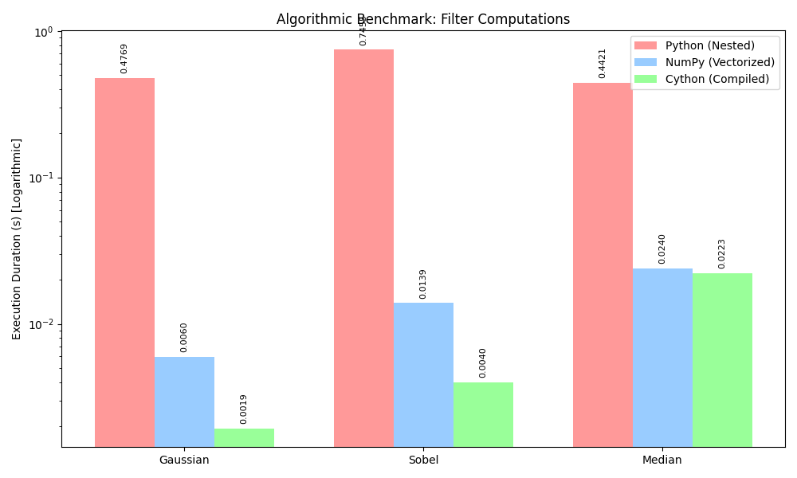

# Performance Analysis: Image Processing Evaluation

**Context:** The target image processed measured 512x512 pixels in geometry.

## 1. Code Implementation Framework

This repository isolates computational logic distinctively:
- **Python Framework (`core/python_ops.py`)**: Abstracted algorithms exclusively relying on core python structures (Lists, Standard loops).
- **NumPy Framework (`core/numpy_ops.py`)**: Overlapping operations utilizing multi-threaded C routines under the NumPy wrapper.
- **Cython Framework (`core/cython_ops.pyx`)**: Ahead-of-time C compiled algorithms skipping all runtime Python bounds checking overhead.

## 2. Performance Analysis

### 2.1 Execution Timeline

| Filter Type | Python (Native) | NumPy (Vectors) | Cython (C-Compiled) |
|-------------|-----------------|-----------------|---------------------|
| **Gaussian**| 0.4769         s| 0.0060         s| 0.0019             s|
| **Sobel**   | 0.7455         s| 0.0139         s| 0.0040             s|
| **Median**  | 0.4421         s| 0.0240         s| 0.0223             s|

**Logarithmic Benchmark Visualization:**

### 2.2 Critical Insights
The transition from pure python interpretation to machine-code translation is staggering. NumPy introduces instant benefits simply by replacing manual iterations with sliding matrices (vectorization). However, Cython takes the lead during nested neighborhood iterations like Convolutions where pre-compiling explicit `uint8_t` memory addressing completely nullifies dynamic runtime bottlenecks native to generic Python data types. 

## 3. Visual Results

The matrices operations output consistent data across the three computation strategies.

- **Gaussian**: Applies spatial uniformity to noise fields.
- **Sobel**: Emphasizes geometry tracking purely calculating X/Y derivatives.
- **Median**: Destroys localized high-variance noise (salt & pepper) effectively without wiping out structural boundaries like blurring does.

### Python Deliverable

### NumPy Deliverable

### Cython Deliverable

